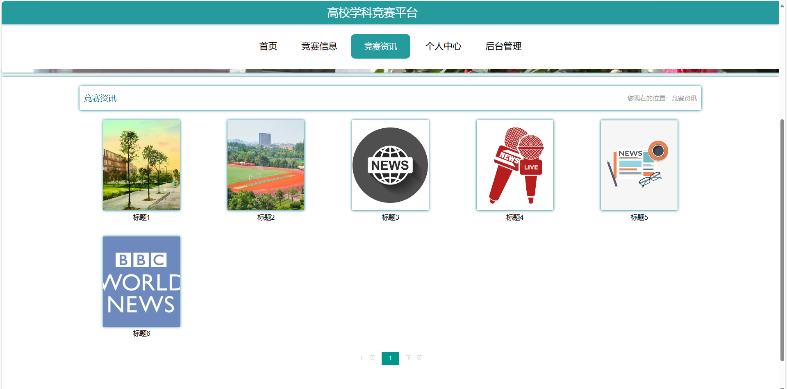

# 基于springboot+vue前后端分离的学校竞赛管理系统

### 9.9￥ 获取完整源码+sql，附赠10000字论文参考，需要的加Q：3808981644 备用Q：3577148218
### 有问题，或者需要协助调试运行项目的也可联系
### 获取更多项目，关注公众号：编程项目集

## 一、介绍

运行环境:idea或eclipse vscode 数据库:mysql

开发语言：java

技术栈：springboot、mybatisplus、vue、html

主要功能：

角色分为学生，教师，领队教师，超级管理员

1、管理员：教师管理、学生管理、领队教师管理、竞赛类型管理、竞赛信息管理、学院管理、专业管理、获奖情况管理、系统管理

2、教师：个人中心、题目类型管理、竞赛题库管理、竞赛类型管理、竟赛信息管理、参赛申请管理、竞赛评分管理、参赛名单管理、晋级名单管理、获奖名单管理、竞赛总结管理、报销清单管理、成绩申诉管理、参赛信息管理

3、领队教师：个人中心、题目类型管理、竟赛题库管理、竞赛类型管理、竟赛信息管理、参赛申请管理、报名信息管理、竞赛评分管理、参名单管理、晋级名单管理、获奖名单管理、竞赛总结管理、报销清单管理、成绩申诉管理、参赛信息管理、往年成绩管理、获奖情况管理

4、学生：首页、竞赛信息、竞赛资讯、个人中心、竟赛题库管理、竞赛类型管理、竟赛信息管理、报名信息管理、竞赛评分管理、参名单管理、晋级名单管理、获奖名单管理、竞赛总结管理、报销清单管理、成绩申诉管理、参赛信息管理、往年成绩管理、获奖情况管理

## 二、部分页面截图展示

## 三、10000字论文参考

### 9.9￥ 获取完整源码+sql，附赠10000字论文参考，需要的加Q：3808981644 备用Q：3577148218
### 有问题，或者需要协助调试运行项目的也可联系

